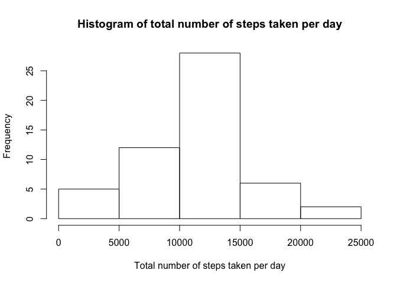
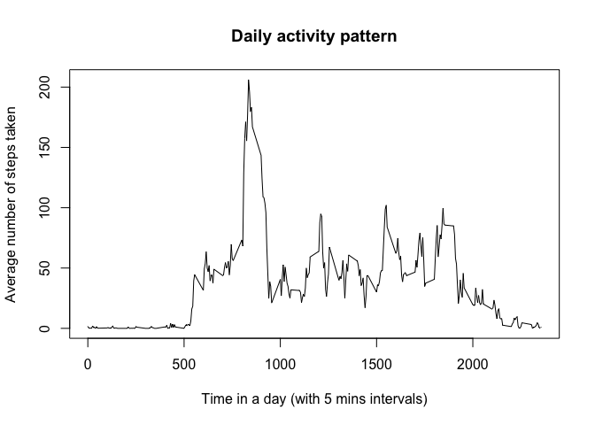
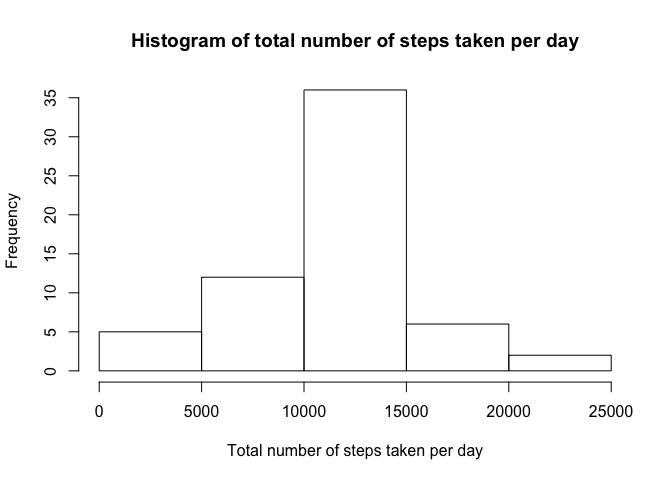
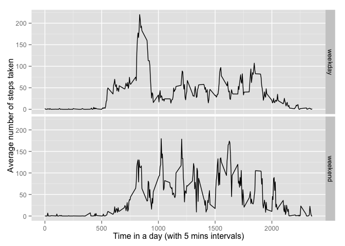

# Reproducible Research: Peer Assessment 1

##Loading and preprocessing the data


```r
activity <- read.csv("activity.csv")
```


##What is mean total number of steps taken per day?

###1. Calculate the total number of steps taken per day

```r
aggregate(formula=steps~date, data=activity, FUN= sum)
```

```
##          date steps
## 1  2012-10-02   126
## 2  2012-10-03 11352
## 3  2012-10-04 12116
## 4  2012-10-05 13294
## 5  2012-10-06 15420
## 6  2012-10-07 11015
## 7  2012-10-09 12811
## 8  2012-10-10  9900
## 9  2012-10-11 10304
## 10 2012-10-12 17382
## 11 2012-10-13 12426
## 12 2012-10-14 15098
## 13 2012-10-15 10139
## 14 2012-10-16 15084
## 15 2012-10-17 13452
## 16 2012-10-18 10056
## 17 2012-10-19 11829
## 18 2012-10-20 10395
## 19 2012-10-21  8821
## 20 2012-10-22 13460
## 21 2012-10-23  8918
## 22 2012-10-24  8355
## 23 2012-10-25  2492
## 24 2012-10-26  6778
## 25 2012-10-27 10119
## 26 2012-10-28 11458
## 27 2012-10-29  5018
## 28 2012-10-30  9819
## 29 2012-10-31 15414
## 30 2012-11-02 10600
## 31 2012-11-03 10571
## 32 2012-11-05 10439
## 33 2012-11-06  8334
## 34 2012-11-07 12883
## 35 2012-11-08  3219
## 36 2012-11-11 12608
## 37 2012-11-12 10765
## 38 2012-11-13  7336
## 39 2012-11-15    41
## 40 2012-11-16  5441
## 41 2012-11-17 14339
## 42 2012-11-18 15110
## 43 2012-11-19  8841
## 44 2012-11-20  4472
## 45 2012-11-21 12787
## 46 2012-11-22 20427
## 47 2012-11-23 21194
## 48 2012-11-24 14478
## 49 2012-11-25 11834
## 50 2012-11-26 11162
## 51 2012-11-27 13646
## 52 2012-11-28 10183
## 53 2012-11-29  7047
```
Note that days with missing values are ignored.


###2. Make a histogram of the total number of steps taken each day

```r
daily_steps <- aggregate(formula=steps~date, data=activity, FUN= sum)
hist(daily_steps$steps,main="Histogram of total number of steps taken per day",xlab="Total number of steps taken per day")
```

 


###3. Calculate and report the mean and median of the total number of steps taken per day

```r
summary(daily_steps$steps)
```

```
##    Min. 1st Qu.  Median    Mean 3rd Qu.    Max. 
##      41    8841   10760   10770   13290   21190
```
The mean and median of the total number of steps taken per day are **"10770"** and **"10760"** respectively.


##What is the average daily activity pattern?

###1. Make a time series plot (i.e. type = "l") of the 5-minute interval (x-axis) and the average number of steps taken, averaged across all days (y-axis)

```r
interval_steps <- aggregate(formula=steps~interval, data=activity, FUN= mean)
plot(interval_steps$interval,interval_steps$steps,type="l",main="Daily activity pattern",xlab="Time in a day (with 5 mins intervals)",ylab="Average number of steps taken")
```

 


###2. Which 5-minute interval, on average across all the days in the dataset, contains the maximum number of steps?

```r
interval_steps$interval[which.max(interval_steps$steps)]
```

```
## [1] 835
```
So, the **8:30-8:35am** interval, on average across all the days in the dataset, contains the maximum number of steps.


##Imputing missing values

###1.Calculate and report the total number of missing values in the dataset (i.e. the total number of rows with NAs)

```r
sum(is.na(activity$steps))
```

```
## [1] 2304
```
So, there are **2304** missing values in the dataset


###2. Devise a strategy for filling in all of the missing values in the dataset. The strategy does not need to be sophisticated. For example, you could use the mean/median for that day, or the mean for that 5-minute interval, etc.

*  First, create a new column with 17568 rows of the average steps taken in a 5 mins interval throughout a day repeated for 61 days (`replace`)
*  Second, merge the new column with the original dataset using `cbind` and form a new data frame `activity_replace` 
*  Third, copy the original data frame `activity` to a new data frame called `activity_filled` 
*  Finally, replace the NAs in `activity_filled` with the respective values in `activity_replace`

###3. Create a new dataset that is equal to the original dataset but with the missing data filled in.

```r
replace<-rep(interval_steps$steps,61)
activity_replace<-cbind(activity,replace=replace)
activity_filled<-activity
activity_filled$steps[is.na(activity_filled$steps)] <- activity_replace$replace[is.na(activity_replace$steps)]
head(activity_filled)
```

```
##       steps       date interval
## 1 1.7169811 2012-10-01        0
## 2 0.3396226 2012-10-01        5
## 3 0.1320755 2012-10-01       10
## 4 0.1509434 2012-10-01       15
## 5 0.0754717 2012-10-01       20
## 6 2.0943396 2012-10-01       25
```


###4. Make a histogram of the total number of steps taken each day and Calculate and report the mean and median total number of steps taken per day. Do these values differ from the estimates from the first part of the assignment? What is the impact of imputing missing data on the estimates of the total daily number of steps?

```r
daily_steps_filled <- aggregate(formula=steps~date, data=activity_filled, FUN= sum)
hist(daily_steps_filled$steps,main="Histogram of total number of steps taken per day",xlab="Total number of steps taken per day")
```

 


```r
summary(daily_steps_filled$steps)
```

```
##    Min. 1st Qu.  Median    Mean 3rd Qu.    Max. 
##      41    9819   10770   10770   12810   21190
```

* The mean and median of the total number of steps taken per day are "10770" and "10770" respectively, compared with part 1, the mean is unchanged but the median is higher (from 10760 to 10770)
* Imputting missing data increase the median and increase the frequency of the total number of steps taken per day between (10000-15000)


##Are there differences in activity patterns between weekdays and weekends?

###1. Create a new factor variable in the dataset with two levels – “weekday” and “weekend” indicating whether a given date is a weekday or weekend day.

```r
activity_filled$wDay <- factor(ifelse(factor(weekdays(as.Date(activity_filled$date,"%Y-%m-%d"))) %in% c("Satuday", "Sunday"), "weekend", "weekday"))
head(activity_filled)
```

```
##       steps       date interval    wDay
## 1 1.7169811 2012-10-01        0 weekday
## 2 0.3396226 2012-10-01        5 weekday
## 3 0.1320755 2012-10-01       10 weekday
## 4 0.1509434 2012-10-01       15 weekday
## 5 0.0754717 2012-10-01       20 weekday
## 6 2.0943396 2012-10-01       25 weekday
```

###2. Make a panel plot containing a time series plot (i.e. type = "l") of the 5-minute interval (x-axis) and the average number of steps taken, averaged across all weekday days or weekend days (y-axis).

```r
interval_steps_new <- aggregate(formula=steps~interval+wDay, data=activity_filled, FUN= mean)
library(ggplot2)
qplot(interval,steps,data=interval_steps_new,facets=wDay~.,geom="line",xlab="Time in a day (with 5 mins intervals)",ylab="Average number of steps taken")
```

 

